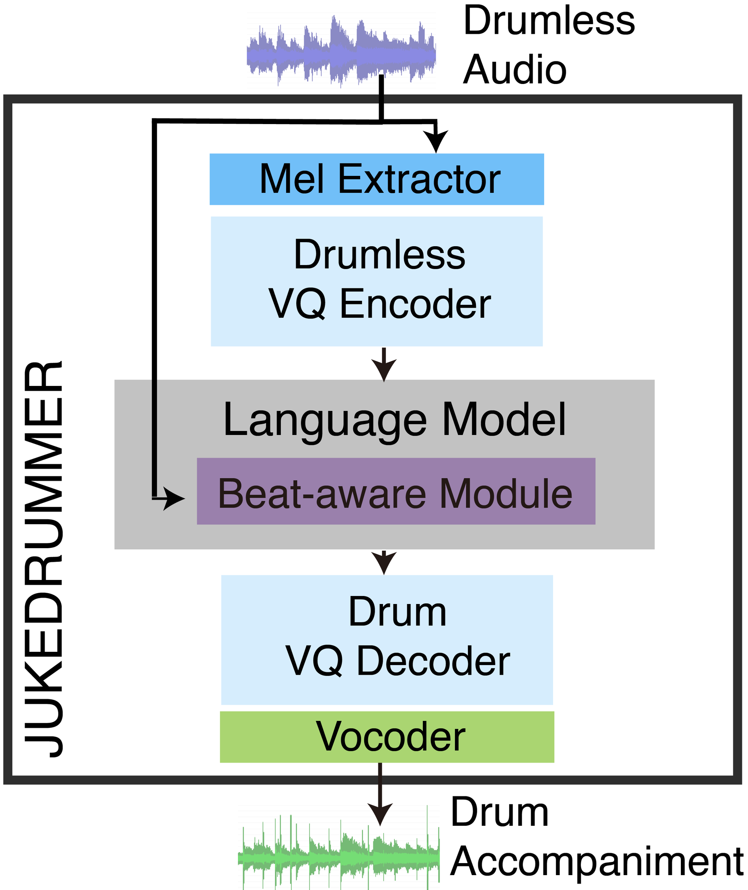

This is the demo page for ISMIR2022 paper [JukeDrummer: Conditional Beat-aware Audio-domain Drum Accompaniment Generation via Transformer VQ-VAE]()

Author: [Yueh-Kao Wu](), [Ching-Yu Chiu](https://github.com/SunnyCYC), [Yi-Hsuan Yang](http://mac.citi.sinica.edu.tw/~yang/)

<iframe width="560" height="580" src="https://www.youtube.com/embed/kfsN_46Rwq0" title="YouTube video player" frameborder="0" allow="accelerometer; autoplay; clipboard-write; encrypted-media; gyroscope; picture-in-picture" allowfullscreen></iframe>

## Abstract
This is the demo page of JukeDrummer, the work generates a drum track in the audio domain to play along to a user-provided drum-free recording. Specifically, using paired data of drumless tracks and the corresponding human-made drum tracks, we train 2 vector-quantized variation autoencoders (VQ-VAE) to discretize both drumless and drum Mel spectrogram. Subsequently, we also train the Transformer to improvise the drum part of an unseen drumless recording with these discretized drum tokens. Finally, we use MelGAN as Vocoder to transform our Mel spectrogram decoded by the decoder of VQ-VAE into the audio wave. This demo page contains several results of our attempts at different domain inputs. 

## Model Structure & Configurations
We have our model highly refer to [Jukebox](https://github.com/openai/jukebox). While there are hundreds of self-attention layers in Jukebox, there are only 9 layers in both encoder and decoder in our work. In addition, we also apply so called "Beat Information Extractor" to extract beat information externally in aid of generating rhythmically consistent drum accompaniment audio.

    <figure>
        
        <figcaption algin='center'>Fig 1. The Flowchart of JukeDrummer</figcaption>
    </figure>
    <figure>
        
        <figcaption algin='center'>Fig 2. The language model of JukeDrummer</figcaption>
    </figure>

## Demo audio
In this demo section contains 3 parts. The first part is the comparison between different model configurations using testing data as input. The second part shows the diversity of our drum accompaniment tracks using our testing data by our best model. Finally, in the third part, we provide some results from our best model using external but famous drumless tracks as input.

### Part 1: Evaluation of Different Model Variants on the Test Set

- Drumless tracks: `Drumless`
- Ground truth of the drum tracks + drumless tracks: `GroundTruth`
- Drum tracks generated by model **with** the transformer encoder and **with** the beat information extractor + drumless tracks: `W/ Encoder W/ BeatInfo`
- Drum tracks generated by model **with** the transformer encoder but **without** the beat information extractor + drumless tracks: `W/ Encoder W/O BeatInfo`
- Drum tracks generated by model **without** the transformer encoder but **with** the beat information extractor + drumless tracks: `W/O Encoder W/ BeatInfo`
- Drum tracks generated by model **without** the transformer encoder but **without** the beat information extractor + drumless tracks: `W/O Encoder W/ BeatInfo`

|   |Drumless|GroundTruth|W/ Encoder W/ BeatInfo|W/ Encoder W/O BeatInfo|W/O Encoder W/ BeatInfo|W/O Encoder W/O BeatInfo|
|1.|<audio src="src/audio/part1/Q1/drumless.wav" controls="" preload=""></audio>|<audio src="src/audio/part1/Q1/gt.wav" controls="" preload=""></audio>|<audio src="src/audio/part1/Q1/1.wav" controls="" preload=""></audio>|<audio src="src/audio/part1/Q1/2.wav" controls="" preload=""></audio>|<audio src="src/audio/part1/Q1/11.wav" controls="" preload=""></audio>|<audio src="src/audio/part1/Q1/12.wav" controls="" preload=""></audio>|
|2.|<audio src="src/audio/part1/Q2/drumless.wav" controls="" preload=""></audio>|<audio src="src/audio/part1/Q2/gt.wav" controls="" preload=""></audio>|<audio src="src/audio/part1/Q2/1.wav" controls="" preload=""></audio>|<audio src="src/audio/part1/Q2/2.wav" controls="" preload=""></audio>|<audio src="src/audio/part1/Q2/11.wav" controls="" preload=""></audio>|<audio src="src/audio/part1/Q2/12.wav" controls="" preload=""></audio>|
|3.|<audio src="src/audio/part1/Q3/drumless.wav" controls="" preload=""></audio>|<audio src="src/audio/part1/Q3/gt.wav" controls="" preload=""></audio>|<audio src="src/audio/part1/Q3/1.wav" controls="" preload=""></audio>|<audio src="src/audio/part1/Q3/2.wav" controls="" preload=""></audio>|<audio src="src/audio/part1/Q3/11.wav" controls="" preload=""></audio>|<audio src="src/audio/part1/Q3/12.wav" controls="" preload=""></audio>|
|4.|<audio src="src/audio/part1/Q4/drumless.wav" controls="" preload=""></audio>|<audio src="src/audio/part1/Q4/gt.wav" controls="" preload=""></audio>|<audio src="src/audio/part1/Q4/1.wav" controls="" preload=""></audio>|<audio src="src/audio/part1/Q4/2.wav" controls="" preload=""></audio>|<audio src="src/audio/part1/Q4/11.wav" controls="" preload=""></audio>|<audio src="src/audio/part1/Q4/12.wav" controls="" preload=""></audio>|
|5.|<audio src="src/audio/part1/Q5/drumless.wav" controls="" preload=""></audio>|<audio src="src/audio/part1/Q5/gt.wav" controls="" preload=""></audio>|<audio src="src/audio/part1/Q5/1.wav" controls="" preload=""></audio>|<audio src="src/audio/part1/Q5/2.wav" controls="" preload=""></audio>|<audio src="src/audio/part1/Q5/11.wav" controls="" preload=""></audio>|<audio src="src/audio/part1/Q5/12.wav" controls="" preload=""></audio>|
|6.|<audio src="src/audio/part1/Q6/drumless.wav" controls="" preload=""></audio>|<audio src="src/audio/part1/Q6/gt.wav" controls="" preload=""></audio>|<audio src="src/audio/part1/Q6/1.wav" controls="" preload=""></audio>|<audio src="src/audio/part1/Q6/2.wav" controls="" preload=""></audio>|<audio src="src/audio/part1/Q6/11.wav" controls="" preload=""></audio>|<audio src="src/audio/part1/Q6/12.wav" controls="" preload=""></audio>|

### Part 2: Evaluation on Diversity

We use our best model `W/ Encoder W/ BeatInfo` to reaptly generate drum tracks with identical parameters and other configurations.

|  |Drumless|GroundTruth|Sample 1|Sample 2|Sample 3|Sample 4|
|1.|<audio src="src/audio/part2/Q1/drumless.wav" controls="" preload=""></audio>|<audio src="src/audio/part2/Q1/gt.wav" controls="" preload=""></audio>|<audio src="src/audio/part2/Q1/1.wav" controls="" preload=""></audio>|<audio src="src/audio/part2/Q1/2.wav" controls="" preload=""></audio>|<audio src="src/audio/part2/Q1/3.wav" controls="" preload=""></audio>|<audio src="src/audio/part2/Q1/4.wav" controls="" preload=""></audio>|
|2.|<audio src="src/audio/part2/Q2/drumless.wav" controls="" preload=""></audio>|<audio src="src/audio/part2/Q2/gt.wav" controls="" preload=""></audio>|<audio src="src/audio/part2/Q2/1.wav" controls="" preload=""></audio>|<audio src="src/audio/part2/Q2/2.wav" controls="" preload=""></audio>|<audio src="src/audio/part2/Q2/3.wav" controls="" preload=""></audio>|<audio src="src/audio/part2/Q2/4.wav" controls="" preload=""></audio>|
|3.|<audio src="src/audio/part2/Q3/drumless.wav" controls="" preload=""></audio>|<audio src="src/audio/part2/Q3/gt.wav" controls="" preload=""></audio>|<audio src="src/audio/part2/Q3/1.wav" controls="" preload=""></audio>|<audio src="src/audio/part2/Q3/2.wav" controls="" preload=""></audio>|<audio src="src/audio/part2/Q3/3.wav" controls="" preload=""></audio>|<audio src="src/audio/part2/Q3/4.wav" controls="" preload=""></audio>|
|4.|<audio src="src/audio/part2/Q4/drumless.wav" controls="" preload=""></audio>|<audio src="src/audio/part2/Q4/gt.wav" controls="" preload=""></audio>|<audio src="src/audio/part2/Q4/1.wav" controls="" preload=""></audio>|<audio src="src/audio/part2/Q4/2.wav" controls="" preload=""></audio>|<audio src="src/audio/part2/Q4/3.wav" controls="" preload=""></audio>|<audio src="src/audio/part2/Q4/4.wav" controls="" preload=""></audio>|

### Part 3: Evaluation on External Data

We use our best model `W/ Encoder W/ BeatInfo` to reaptly generate drum tracks with external input data. We use [spleeter](https://github.com/deezer/spleeter) to extract drumless tracks of the first and the second tracks.

**Earth, Wind & Fire - September**
<iframe width="560" height="315" src="https://www.youtube.com/embed/Gs069dndIYk?start=50" title="YouTube video player" frameborder="0" allow="accelerometer; autoplay; clipboard-write; encrypted-media; gyroscope; picture-in-picture" allowfullscreen></iframe>

|Drumless|Sample 1|Sample 2|Sample 3|
|<audio src="src/audio/part3/september/drumless.wav" controls="" preload="">drumless extracted by spleeter</audio>|<audio src="src/audio/part3/september/1.wav" controls="" preload=""></audio>|<audio src="src/audio/part3/september/2.wav" controls="" preload=""></audio>|<audio src="src/audio/part3/september/3.wav" controls="" preload=""></audio>|

**伍佰 Wu Bai & China Blue - 挪威的森林 Norwegian fores**
<iframe width="560" height="315" src="https://www.youtube.com/embed/gPpZJlE0Ca8?start=122" title="YouTube video player" frameborder="0" allow="accelerometer; autoplay; clipboard-write; encrypted-media; gyroscope; picture-in-picture" allowfullscreen></iframe>

|Drumless|Sample 1|Sample 2|Sample 3|
|<audio src="src/audio/part3/norway/drumless.wav" controls="" preload="">drumless extracted by spleeter</audio>|<audio src="src/audio/part3/norway/1.wav" controls="" preload=""></audio>|<audio src="src/audio/part3/norway/2.wav" controls="" preload=""></audio>|<audio src="src/audio/part3/norway/3.wav" controls="" preload=""></audio>|

**All of me**
<iframe width="560" height="315" src="https://www.youtube.com/embed/vl7QFVt2jwM" title="YouTube video player" frameborder="0" allow="accelerometer; autoplay; clipboard-write; encrypted-media; gyroscope; picture-in-picture" allowfullscreen></iframe>

|Drumless|Sample 1|Sample 2|Sample 3|
|<audio src="src/audio/part3/all/drumless.wav" controls="" preload="">original drumless</audio>|<audio src="src/audio/part3/all/1.wav" controls="" preload=""></audio>|<audio src="src/audio/part3/all/2.wav" controls="" preload=""></audio>|<audio src="src/audio/part3/all/3.wav" controls="" preload=""></audio>|

**Coldplay - Viva La Vida**

<iframe width="560" height="315" src="https://www.youtube.com/embed/dvgZkm1xWPE?start=70" title="YouTube video player" frameborder="0" allow="accelerometer; autoplay; clipboard-write; encrypted-media; gyroscope; picture-in-picture" allowfullscreen></iframe>

|Drumless|Sample 1|Sample 2|Sample 3|
<audio src="src/audio/part3/viva/drumless.wav" controls="" preload="">original drumless</audio>|<audio src="src/audio/part3/viva/1.wav" controls="" preload=""></audio>|<audio src="src/audio/part3/viva/2.wav" controls="" preload=""></audio>|<audio src="src/audio/part3/viva/3.wav" controls="" preload=""></audio>|

## Limitation

First, the generalizability of our model is not good enough. According to our own observation, our model is capable to perform functionally when using most of our testing data as input which is divided from the joined dataset of MUSDB18, MedleyDB, and MixingSecret prior to our training. However, the results are relatively worse when using recordings of drumless music outside our joined dataset as input. We conjecture that our model is sensitive to audio compression, original sample rate, or the way the music is mixed and mastered. 

Second, the stability of our model still needs to be improved. At times, the model struggles to change its tempo going through different sections of a song. Moreover, the generation might be out of sync with the input in the beginning few seconds, until the model gets sufficient context.

Last but not least, it would be helpful if the drumless input contains some "rhythmical hints", such as strong bass, rhythm guitar, and any other sources that can be conducive for our model to locate beats and downbeats. If so, the model is likely to perform better. On the other hand, if the model can't get enough clues from input to locate beats and tempo, the result of generation would be pretty bad. 

To sum up, issues related to generalizability, stability, and rhythm dependency are issues that should be addressed in future works.

### Contact 

Yueh-Kao Wu 
yk.lego09@gmail.com
